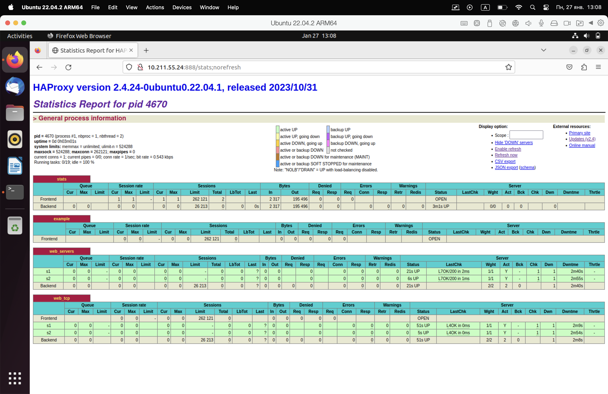
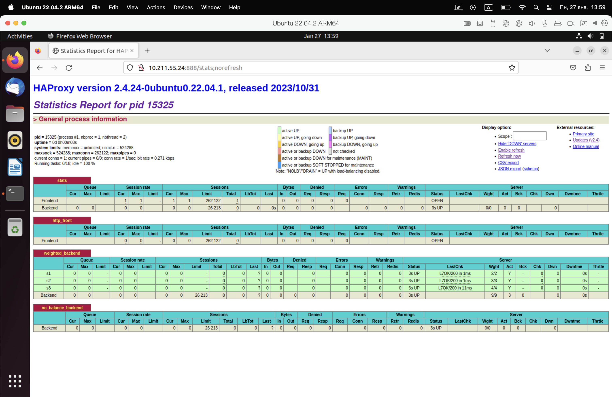

# Домашнее задание к занятию "`Кластеризация и балансировка нагрузки`" - `Никита Селиверстов`


### Задание 1

   1. 
   Для выполнения задания выполнил сделующие команды.
   ```
   cd /tmp
   python3 -m http.server 8888 
   cd /tmp
   python3 -m http.server 9999
   ``` 
   2. 
   Установка и настройка HAProxy.
   ```
   sudo apt update
   sudo apt install haproxy
   ```
   Настройка конфигурации 
   `sudo nano /etc/haproxy/haproxy.cfg`
   
```
   global
    log /dev/log    local0
    log /dev/log    local1 notice
    chroot /var/lib/haproxy
    stats socket /run/haproxy/admin.sock mode 660 level admin expose-fd listeners
    stats timeout 30s
    user haproxy
    group haproxy
    daemon

    ca-base /etc/ssl/certs
    crt-base /etc/ssl/private

    # Параметры SSL (можно не трогать, если SSL не используете)
    ssl-default-bind-ciphers ECDHE-ECDSA-AES128-GCM-SHA256:...
    ssl-default-bind-ciphersuites TLS_AES_128_GCM_SHA256:...
    ssl-default-bind-options ssl-min-ver TLSv1.2 no-tls-tickets

defaults
    log     global
    mode    http
    option  httplog
    option  dontlognull
    timeout connect 5000
    timeout client  50000
    timeout server  50000
    errorfile 400 /etc/haproxy/errors/400.http
    errorfile 403 /etc/haproxy/errors/403.http
    errorfile 408 /etc/haproxy/errors/408.http
    errorfile 500 /etc/haproxy/errors/500.http
    errorfile 502 /etc/haproxy/errors/502.http
    errorfile 503 /etc/haproxy/errors/503.http
    errorfile 504 /etc/haproxy/errors/504.http


# --- Страница статистики HAProxy (на порту 888) ---
listen stats
    bind :888
    mode http
    stats enable
    stats uri /stats
    stats refresh 5s
    stats realm Haproxy\ Statistics

# --- Пример L7 (HTTP) фронтенда + бэкенда ---
frontend example
    bind :8088
    mode http
    # Простой ACL по доменному имени (пример)
    acl ACL_example.com hdr(host) -i example.com
    use_backend web_servers if ACL_example.com
    default_backend web_servers  # если не совпадает ACL

backend web_servers
    mode http
    balance roundrobin
    option httpchk
    http-check send meth GET uri /index.html
    server s1 127.0.0.1:8888 check
    server s2 127.0.0.1:9999 check

# --- Пример L4 (TCP) балансировки (Round Robin) ---
listen web_tcp
    bind :1325
    mode tcp           # ключевой момент: режим TCP вместо HTTP
    balance roundrobin
    # Интервал проверок (health check)
    server s1 127.0.0.1:8888 check inter 3s
    server s2 127.0.0.1:9999 check inter 3s
```
Создал файл index.html в дериктории tmp

   

### Задание 2
1. Запускаем три Python‐сервера на разных портах, скажем, 8081, 8082, и 8083
```
python3 -m http.server 8081
python3 -m http.server 8082
python3 -m http.server 8083
```
2. Добавляем запись в /etc/hosts `10.211.55.24   example.local`
3.  Редактируем haproxy
```
global
    log /dev/log    local0
    log /dev/log    local1 notice
    chroot /var/lib/haproxy
    stats socket /run/haproxy/admin.sock mode 660 level admin expose-fd listeners
    stats timeout 30s
    user haproxy
    group haproxy
    daemon

defaults
    log     global
    mode    http
    option  httplog
    option  dontlognull
    timeout connect 5000
    timeout client  50000
    timeout server  50000

# --- Страница статистики ---
listen stats
    bind :888
    mode http
    stats enable
    stats uri /stats
    stats refresh 5s
    stats realm Haproxy\ Statistics

# --- Фронтенд, который слушает HTTP, например на 80-м порту ---
frontend http_front
    bind :80
    mode http
    # ACL: проверяем заголовок Host
    acl host_example hdr(host) -i example.local
    # Если домен соответствует example.local --> идем в наш weighted_backend
    use_backend weighted_backend if host_example

    # Если домен НЕ соответствует example.local --> можно либо отправлять в "пустой" backend,
    # либо выдавать 403, 404 и т.п.
    default_backend no_balance_backend

# --- Бэкенд с Weighted Round Robin ---
backend weighted_backend
    mode http
    balance roundrobin        # базовый round-robin
    # Пример health-check'а
    option httpchk GET /
    # Три сервера, веса 2, 3 и 4 (соответственно s1, s2, s3)
    server s1 127.0.0.1:8081 weight 2 check
    server s2 127.0.0.1:8082 weight 3 check
    server s3 127.0.0.1:8083 weight 4 check

# --- Бэкенд "заглушка" для остальных доменов ---
backend no_balance_backend
    mode http
    # Можно, к примеру, возвращать ошибку 403, 
    # или отдавать статическую страницу, или редиректить:
    errorfile 403 /etc/haproxy/errors/403.http
```

   

### Задание 3
   1. 

### Задание 4
   1. 